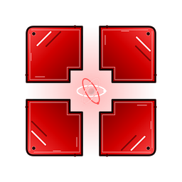

  

<h1 align="center">Orbitstrap</h1>

  A Roblox bootstrapper inspired by the best of the community — combined into one.

  
  
  
  

  <a href="https://orbitstrap.vercel.app/">Website</a> ·
  <a href="https://github.com/orbitthegreatest/Orbitstrap/releases/latest">Download</a>

---

> [!IMPORTANT]
> Orbitstrap currently supports **Windows 10 and above**.

## What is Orbitstrap?

Orbitstrap is a Roblox bootstrapper built from scratch, inspired by several community projects. It brings together ideas and features from the bootstrapper scene into a single, unified launcher.

---

## Features

- 🚩 **FFlags Settings** — fast flag editor built directly into the app
- 🔄 **Auto Rejoin** — automatically rejoins your server after a disconnect
- 🖥️ **Multi-Instance Launching** — run multiple Roblox clients at once
- 🚫 **Disable Roblox Features** — block Roblox video recording and screenshots
- 🎨 **Appearance customization** — themes, backgrounds, and more
- 🌍 **Server Manager** — pick and manage your preferred servers
- 🎮 **Discord Rich Presence** — advanced RPC with game info, server status, and more
- ⚡ **FPS Unlocker** — remove the 240 FPS cap without FastFlags
- 🔧 **Custom Integrations** — launch your own apps alongside Roblox

---

## Installation

1. Go to [**Releases**](https://github.com/orbitthegreatest/Orbitstrap/releases/latest)
2. Download `Orbitstrap.exe`
3. Run it and follow the setup
4. Launch Roblox through Orbitstrap and enjoy!

---

## Frequently Asked Questions

**Can it get me banned?**
No. Orbitstrap does not inject cheats or bypass Roblox security. It is a launcher and configuration manager only.

**Is it a virus?**
No. Orbitstrap is fully open source — you can read every line of code yourself right here on GitHub. If your antivirus flags it, it is a false positive caused by how launchers interact with Roblox.

---

## Building from Source

Requires **Visual Studio 2022** and **.NET 8+**

1. Clone the repo
2. Open `Orbitstrap.sln` in Visual Studio
3. Set build config to **Release**
4. Press **Build → Build Solution**

---

## Inspiration & Credits

Orbitstrap was inspired by the following community bootstrapper projects. Full credit goes to their respective authors.

| Project | Author |
|---|---|
| [Bloxstrap](https://bloxstraplabs.com/) | bloxstraplabs |
| [Voidstrap](https://github.com/KloBraticc/Voidstrap) | KloBraticc |
| [Froststrap](https://github.com/RealMeddsam/Froststrap) | RealMeddsam |
| [Fishstrap](https://github.com/fishstrap/fishstrap) | fishstrap |
| [Leitostrap](https://github.com/Leitostrap/Leitostrap-Boostrapper) | Leitostrap |

---

Made with ❤️ by orbitthegreatest

